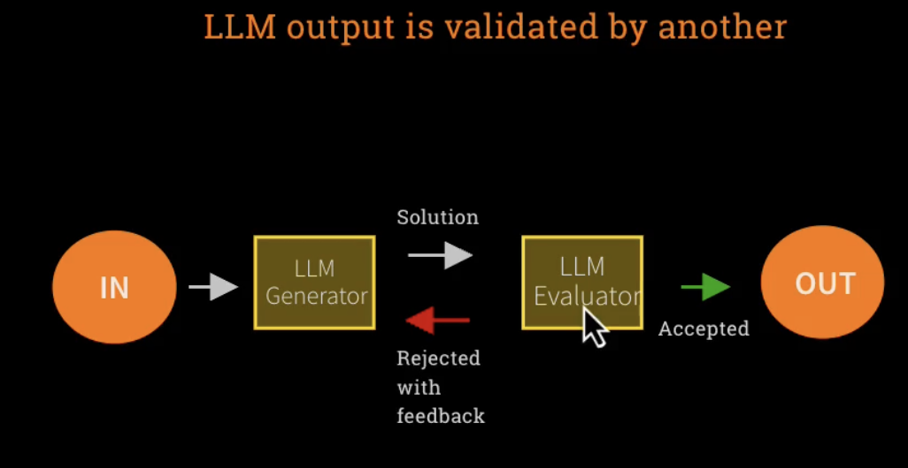

# What is an Agent ?

Autonomy generally in this context means that LLM are free to choose a path out of multiple paths.

In foundation/lab1 end exercise was to ask LLM to find out some business area where AI agents can solve problem.
Then out of these areas the LLMs were asked to choose a pain point. Now here in the first step there could be many business area but we gave the LLM the autonomy to choose the business area that it to choose. So on.

**In the anthropic blog writing effective agents, it describes Agentic Systems in 2 categories:**
1. workflow agents - these are systems where LLM and tools are orchestrated through predefined paths 

2. Agents - systems where LLMs dynamically direct their own processes and tools usage , maintaining control over how they accomplish tasks.

 
 
 

# Workflow Design Patterns

### 1. Prompt Chaining
We can write some code such that , we pass output of one LLM to another LLM and so on.

**Note - The Blue boxes represent our code maybe python or java**

Basically we are chaining a series of LLM calls decomposing into a fixed set of subtasks.
This way we can break down our requirements in small subtasks such that we can pass the subtasks to each LLM call to get the best possible response for the subtask. 

Then at the end we can orchestrate the subtasks

### 2. Routing
THere will be a specialist model that will evaluate based on the input prompt and then determine which of the other models should process the input prompt based on the contents of the input prompt.

**This is useful when we have different LLMs with different level of expertise and we want to use the best possible LLM based on the requirement in the input prompt.**

### 3. Parallelization
In this pattern we write some code that takes a task and breaks it down into multiple smaller pieces that should all run parallely.
![
    

**Note - The Blue boxes represent our code maybe python or java**

### 4. Orchestrator Worker-
It is when a complex challenging tasks is broken down anf then combined.
It is almost same as Parallelizartion only difference between in case of parallelization the breaking down of the tasks into smaller chunk is done by our code but here that is done by a LLM as well.

**Note - The distinction between workflow and agents system is not very definitive. Theyc an be interchangebealy pay mew**

### 5. Evaluator -Optimizer
One LLM generates the output from the prompt passed and other LLM evaluates the response generated from the for first LLM. This LLM can either choose to access or reject the output.
If it is accepted then good, if rejected the LLM must provide the reason for rejection as well.

Then the rejection and the reason for rejection then has to go to the first model

Note - This pattern is a very good way to improve the accuracy of the models. But it is still not a guarentee as it is in case of LLMs.

 
 
 
 
 
 

# Agents Patterns:

### 1. Open-Ended:
With Agents the process is more open ended. It is something that can keep going.

### 2. Feedback Loops :
it has feedback loops so that for the decision and steps it takes it gets some data on the feedback of those decision and steps so that the steps can be improved.

### 3. No Fixed Paths :
Like in the case of workflow design patterns , there is no fixed paths. Agents systems are more fluid and dynamic.

As a result of the above properties , there are hugely more number of use cases where agents systems can be implemented . But also because of the above patterns the agents system are unpredictable and there are concern on guardails , robustness etc.

Here we do not have output rather than environment.
this is meant to reflect a outside world that we can interact with.
Like when we connect our agents to the light bulbs and ask the agent to turn on the light bulbs.

The light bulb is the environment. The human sends a input
The LLM takes action based on the input on the environment.
Then the LLM gets back the output as feedback.
This can go on in loops until the LLM stops.

# Risks of Agentic AI

## Mitigations to the above -
